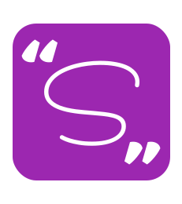

<div align="center">
    <h1 align="center">Sentency Web</h1>
    <h5>Project Sentency</h5>
    
</div>

Web client of the Sentency Project created using Angular and Typescript. This project was generated
with [Angular CLI](https://github.com/angular/angular-cli) version 12.0.4.

## Third-Party frameworks

The list of all the third party frameworks used in this project:

* [Angular Material](https://material.angular.io/): Material Design components for Angular


## Docker image

To deploy the project first is necessary to build the Docker image. Use the command:

```bash
docker build -t sentency-web .
```
